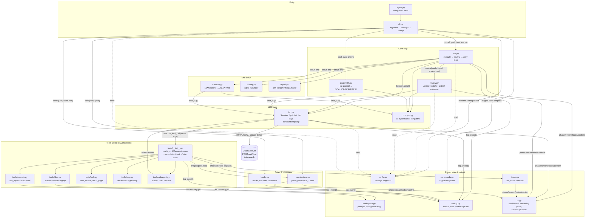
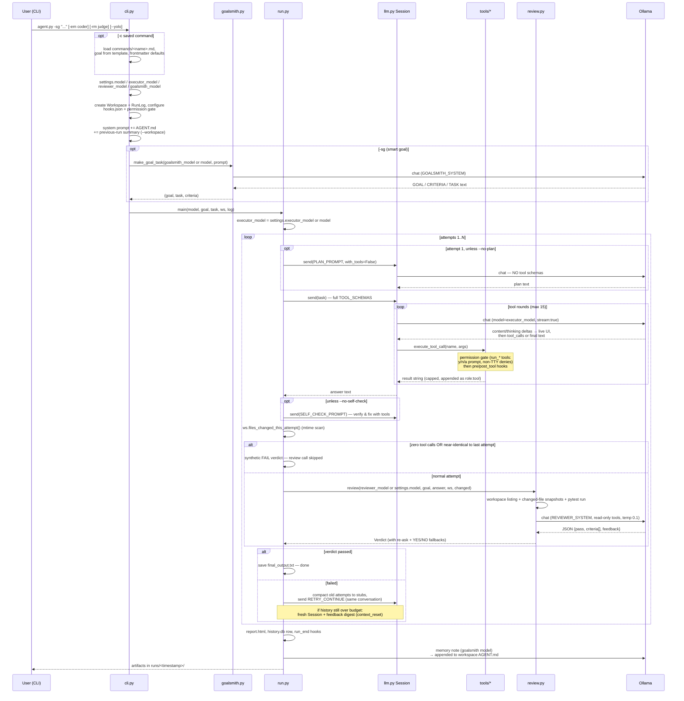
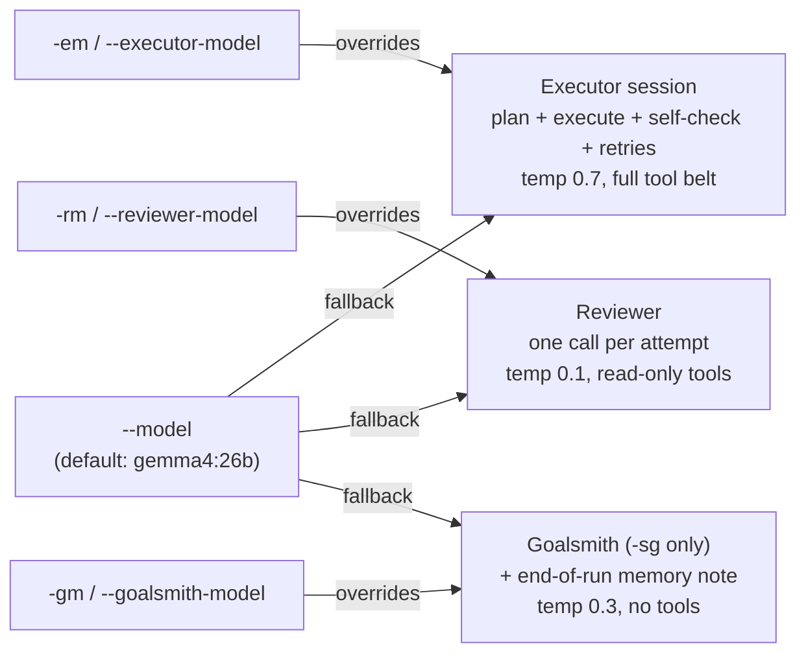
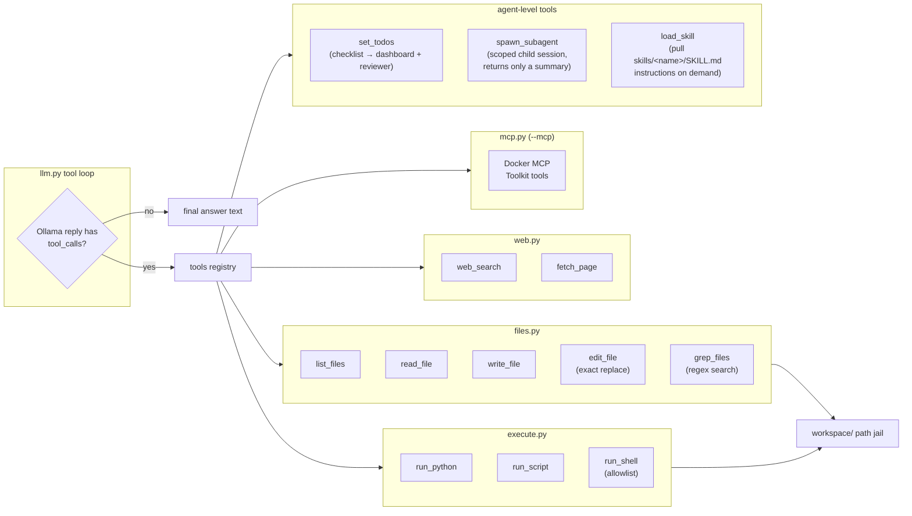

# Execute → Review → Retry Agent

A lightweight autonomous agent harness powered by a local [Ollama](https://ollama.com/) instance
(designed to run against an Ollama server on another computer on your network).

An **executor** LLM does the work with real tools in an isolated per-run workspace, a
**reviewer** LLM checks the actual files on disk against the goal, and failed attempts are
retried with the reviewer's feedback — in the *same* conversation, so the model remembers
what it already tried.

```bash
python3 agent.py -g "Write fizzbuzz.py that prints FizzBuzz for 1-30, run it, and confirm the output"
```

## Architecture

Every box below is one file in `harness/`. Arrows show who calls whom.



## The run loop, end to end

What actually happens on `python3 agent.py -sg "..."`, in order:



## Which model runs where

`--model` is the default for every role; each role can be overridden independently
(the Claude-Code pattern of a cheap default plus specialists):



- The plan and self-check turns live **inside the executor session**, so `-em` covers them too,
  and **subagents** spawned with `spawn_subagent` use the executor model as well.
- The end-of-run **memory note** (AGENT.md lessons) rides the goalsmith model — cheap and small is fine.
- The resolved models are logged in the `run_start` event of `events.jsonl` and shown in the
  dashboard header.
- Models that don't support Ollama's `think` parameter (e.g. `qwen2.5-coder`) are detected on
  the first 400 response and retried without it — no crash, no flag needed.

```bash
python3 agent.py -g "..." -em qwen2.5-coder:7b            # coder executes, default model judges
python3 agent.py -sg "..." -gm gemma4:26b -em codestral   # general model shapes the goal, coder builds
```

## Data exchange between files

Who produces what, and who consumes it:

| Data | Produced by | Consumed by | Shape |
|---|---|---|---|
| `Settings` | `config.py` (defaults) + `cli.py` (one mutation at startup) | every module, read-only | dataclass singleton `settings` |
| `(goal, task, criteria)` | `goalsmith.py` (`-sg`), `commands.py` (`-c` template), or verbatim from `-g` | `run.py` (executor msg), `review.py` (checklist) | `tuple[str, str, list[str]]` |
| Executor system prompt | `prompts.EXECUTOR_SYSTEM` + `cli.py` appends AGENT.md, the previous-run resume summary, and MCP tool notes | `llm.Session` (message 0) | string |
| Conversation history | `llm.Session.messages` — grows with every turn, compacted between attempts | Ollama `/api/chat` payload | `list[{role, content, tool_calls?}]` |
| Stream deltas | Ollama line-JSON chunks, aggregated in `llm._consume_stream` | `ui.stream_delta` (live panel / progressive print); Session sees only the final message | text fragments |
| Tool calls | Ollama reply `tool_calls` | `tools.execute_tool_call` → permission check → hooks → dispatch → result appended back as a `role: tool` message | name + JSON args → capped string |
| Permission decision | `permissions.check()` (y/n/a prompt, `_always` grants, non-TTY auto-deny) | `execute_tool_call` (denial returned to the model as `[ERROR]`), `permission` events | `None` (allow) or error string |
| Todo checklist | `set_todos` tool → `todos.current` | dashboard panel, `REVIEW_USER` ("self-reported — verify") | `[{text, status}]` |
| Subagent summary | child `Session` in `tools/subagent.py` (fresh context, executor model) | parent's tool result, capped like any other | string |
| Changed files | `workspace.files_changed_this_attempt()` (mtime scan — catches files written by *any* tool) | `review.py` snapshots, `run.py` stall gate, logs | `list[str]` relative paths |
| Review evidence | `workspace.snapshot_files()` + `review.automated_checks()` (pytest) | `REVIEW_USER` prompt | capped text blocks |
| `Verdict` | `review.parse_verdict()` (JSON → re-ask → YES/NO → default NO) | `run.py` pass/retry decision, retry feedback | `{passed, criteria[], feedback}` |
| Retry message | `run.py` from `Verdict.unmet()` + feedback history | same executor `Session` (preferred) or a fresh one | `RETRY_CONTINUE` / `RETRY_NOTE` template |
| `events.jsonl` | `runlog.log_event()` called from `run.py`, `llm.py`, `tools/`, `hooks.py`, `permissions.py` | `report.py`, `evals/run_evals.py`, the resume summary, you | one JSON object per line |
| Memory note | `memory.update_agent_md()` — goalsmith-model call at run end, bullets appended as a dated section | `<workspace>/AGENT.md` → next run's system prompt | markdown section, trimmed to budget |
| Resume summary | `cli._load_resume_context()` — mechanical, from the previous run's `events.jsonl` / `attempt_history.json` | executor system prompt on `--workspace` reuse | capped text block |
| Hook commands | user-authored `hooks.json` at the repo root | `hooks.fire()` on pre/post_tool, attempt_end, run_end (observe-only) | shell commands with `{placeholders}` |
| `runs/history.db` | `history.record()` at run end | `agent.py history` / `history --stats` | sqlite row per run |
| `report.html` | `report.py` at the end of every run | your browser | self-contained HTML |

Two deliberately global handles keep the deep call sites simple: `config.settings`
(read everywhere, written only by `cli.py` at startup) and `runlog.current` (so
`llm._post_chat` and `execute_tool_call` can log without threading a logger through
every signature). Tools get the workspace bound via `functools.partial` in
`tools.configure(ws)` — the LLM never sees or passes filesystem paths outside the jail.

## Per-run isolation

Every run gets its own directory — nothing is written to the repo root, and leftovers
from one run can't confuse the next:

```
runs/run_20260703_154139/
├── workspace/           # the ONLY directory the agent can see and touch
│   └── AGENT.md         # project context: auto-loaded at start, memory notes appended at end
├── transcript.md        # human-readable log of every attempt + verdict
├── events.jsonl         # machine log: llm calls (real token counts), tool calls, attempts
├── attempt_1.txt        # prose of each failed attempt
├── attempt_history.json
├── report.html          # self-contained visual report
└── final_output.txt     # or final_output_UNVERIFIED.txt if attempts ran out
runs/latest              # symlink to the most recent run
runs/history.db          # sqlite index over ALL runs (agent.py history)
```

The jail is `workspace.resolve()`: every file tool resolves its path against
`workspace/` and refuses anything that escapes it (`../`, absolute paths). Change
tracking is mtime-based, so the reviewer judges files however they were produced —
`write_file`, `run_python`, a shell command, anything.

The workspace is also a **git repo** (`--no-git` disables): the harness commits the
starting state, then one commit per attempt, and the reviewer receives the attempt's
`git diff` instead of truncated file snapshots — every change fits the evidence budget,
and a bad attempt can be rolled back with plain git. Snapshots remain the fallback when
git is unavailable or the diff is empty.

Reuse a previous workspace (to continue earlier work) with
`--workspace runs/run_.../workspace`.

## The tool belt



Three tools work on the agent itself rather than the workspace, all borrowed from
Claude Code:

- **`set_todos`** — the executor declares and updates its checklist (`pending` /
  `in_progress` / `done`). It shows live in the dashboard, is logged as `todos` events,
  and the final state is handed to the reviewer labeled *self-reported — verify against
  the workspace*, so claimed-done vs actually-done is visible.
- **`spawn_subagent`** — delegates a self-contained subtask (exploration, research, a
  contained build step) to a fresh child session with its own context and a smaller
  tool-round budget (`subagent_max_rounds`, default 8). Only the child's final summary
  returns to the parent, capped like any tool result — the parent's context stays small.
  Subagents can't spawn subagents, and the child doesn't get `set_todos` (the checklist
  belongs to the parent). There's no CLI flag: the **executor decides** to call it when a
  goal has a delegate-able chunk, so smaller local models may need the goal to name the
  delegation explicitly. The child runs under `SUBAGENT_SYSTEM` (act directly, end with a
  <200-word summary of files/commands/facts) on the executor model, and each spawn is
  bracketed by `subagent_start` / `subagent_end` events in `events.jsonl`.
- **`load_skill`** — loads the full instructions of a skill from
  `skills/<name>/SKILL.md`. A compact index (name + one-line description per skill)
  is injected into the executor and subagent system prompts; the model calls
  `load_skill(name)` when a description matches the work at hand and the body
  (capped at `skill_body_max`, default 8,000 chars) arrives as a tool result —
  progressive disclosure, so unused skills cost almost nothing. Read-only, never
  permission-prompts; each load is a `skill` event. The reviewer never sees skills.
  `--no-skills` disables the index and the tool.

Guardrails on the risky tools come from **`policy.json`** (see below), not from constants
in the code: by default `run_shell` only accepts one plain allowlisted command
(`pip`, `pip3`, `python3`, `pytest`, `ls`, `mkdir`, `cat`, `echo` — no pipes, chaining, or
redirection, enforced with `shell=False`), and `fetch_page` refuses local/private-network
addresses. `run_python`/`run_script` execute with the workspace as cwd and per-call timeouts.

With **`--sandbox`** the execute tools run inside a per-run Docker container instead
(`--sandbox-image`, default `python:3.12-slim`, workspace mounted at `/ws`). The container
is the guardrail there, so the shell allowlist is lifted: any command, pipes, chaining,
and `pip install`s that persist for the rest of the run (one long-lived container per
workspace, removed at exit).

The reviewer gets a **read-only subset** (`read_file`, `list_files`, `run_script`,
`run_shell`) so it can gather evidence but never fix the work itself. `--no-reviewer-tools`
drops even those for a faster snapshot-only review.

## Usage

```bash
python3 agent.py -g "Write fizzbuzz.py that prints FizzBuzz for 1-30, run it, and confirm the output"
python3 agent.py -sg "I need a small flask api for notes"          # goalsmith mode
python3 agent.py -g "..." --model qwen3.5:9b --attempts 3
python3 agent.py -g "..." -rm qwen3.6:27b                          # bigger model as judge (--reviewer-model)
python3 agent.py -g "..." -em qwen2.5-coder:7b                     # coding model for the executor only (--executor-model)
python3 agent.py -sg "..." -gm gemma4:26b -em codestral            # separate goalsmith model (--goalsmith-model)
python3 agent.py -g "..." --num-ctx 32768 --full-context           # no trimming at all
python3 agent.py -g "..." --mcp                                    # + Docker MCP Toolkit tools
python3 agent.py -g "..." --mcp --mcp-profile work                 # specific MCP Toolkit profile
python3 agent.py -g "Delegate the file survey to a subagent, then write a report"  # invites spawn_subagent
python3 agent.py -g "..." --workspace runs/latest/workspace        # continue earlier work
python3 agent.py -g "..." -i                                       # steer failed attempts by hand (--interactive)
python3 agent.py -g "..." --sandbox                                # execute tools inside a Docker container
python3 agent.py -g "..." --no-git                                 # snapshot evidence instead of git diffs
python3 agent.py -g "..." --no-reviewer-tools                      # faster, snapshot-only review
python3 agent.py -g "..." --best-of 3                              # 3 independent first attempts, keep the best
python3 agent.py -g "..." --no-plan --no-self-check                # skip the quality turns (faster)
python3 agent.py -c fix-tests "focus on test_api"                  # saved command from commands/fix-tests.md
python3 agent.py -g "..." --yolo                                   # skip permission prompts (needed for cron/pipes)
python3 agent.py -g "..." --policy policy.strict.json              # run under tighter guardrails (refuses --yolo)
python3 agent.py -g "..." --no-stream --no-memory                  # disable streaming / AGENT.md notes
python3 agent.py history                                           # past runs from runs/history.db
python3 agent.py history --stats                                   # pass-rate per executor model
python3 agent.py history --limit 50                                # more rows (default: 20)
```

Every attempt runs three phases by default: a **planning turn** (attempt 1 only — the
model commits to filenames and a verification step before touching tools), the
**execution** itself, and a **self-check turn** (re-verify each criterion with tools and
fix failures before the reviewer sees it). `--best-of N` additionally runs N independent
first attempts in separate `candidate_*` workspaces, reviews each, and continues the loop
from the winner. On a real terminal you get a live rich dashboard (attempt/phase/token
budget/tool log/todos/streaming panel); piped output falls back to plain lines with
progressive streaming. Every run ends by writing a self-contained **`report.html`**
into the run dir (regenerate with `python3 -m harness.report runs/latest`), recording
a row in `runs/history.db`, and appending a memory note to the workspace AGENT.md.

## Context management

Local models have small windows, so the harness spends tokens deliberately:

- **Compaction between attempts** — finished failed attempts are collapsed to one-line
  stubs; the model keeps *that* it tried something and *why* it failed, not every byte.
- **Same-session retries** — the preferred retry path continues the existing conversation.
  Only when the history exceeds the budget even after compaction does the harness start a
  fresh session with a digest of all reviewer feedback (logged as `context_reset`).
- **Caps everywhere** — tool results, reviewer snapshots, retry context, and page text are
  all bounded by knobs in `config.py` (`tool_result_max`, `retry_prev_max`, ...).
- **Real token counts** — Ollama's `prompt_eval_count` is logged per call, and the harness
  warns when a prompt passes 85% of `--num-ctx`.
- `--full-context` disables all of it for models with room to spare.

## Project structure

```
agent.py              # entry-point shim (python3 agent.py -g ...)
policy.json           # the guardrails this repo runs under (--policy to swap)
policy.strict.json    # worked example: nothing executes without a human at a TTY
policy.open.json      # worked example: real shell, no gate (throwaway VM only)
harness/
├── cli.py            # argument parsing, settings mutation, AGENT.md/MCP wiring
├── config.py         # Settings dataclass: models per role, budgets, temperatures
├── prompts.py        # executor / reviewer / goalsmith / retry prompt templates
├── llm.py            # Ollama chat, Session (persistent retry memory), context budgeting
├── workspace.py      # per-run dirs, path jail, mtime-based change tracking
├── runlog.py         # transcript.md + events.jsonl writers
├── review.py         # JSON verdicts with fallback parsing, automated pytest checks
├── goalsmith.py      # -sg: request → goal + criteria + task
├── todos.py          # the executor's self-maintained checklist (set_todos)
├── memory.py         # end-of-run AGENT.md lessons notes
├── history.py        # sqlite run index (agent.py history)
├── commands.py       # commands/*.md loader (-c)
├── skills.py         # skills/<name>/SKILL.md index + load_skill tool
├── hooks.py          # observe-only hooks.json event hooks
├── policy.py         # policy.json loader/validator: the guardrails as data
├── permissions.py    # y/n/a gate for the policy's gated tools (--yolo)
├── run.py            # the execute → review → retry loop (+ plan/self-check/best-of)
├── ui.py             # rich live dashboard, plain-print fallback
├── report.py         # self-contained report.html per run
└── tools/
    ├── __init__.py   # registry, Ollama schemas, execute_tool_call dispatch
    ├── files.py      # read/write/edit/list/grep, all jailed
    ├── execute.py    # run_python / run_script / run_shell (policy allowlist)
    ├── subagent.py   # spawn_subagent: scoped child sessions
    ├── web.py        # web_search (ddgs), fetch_page (trafilatura)
    └── mcp.py        # Docker MCP Toolkit gateway client
skills/               # model-loadable skills, one SKILL.md per subdirectory
tests/                # pytest suite for the harness itself (venv/bin/python -m pytest)
evals/                # benchmark goals + runner for measuring harness changes
```

## Requirements

- **Python 3.10+**
- **Ollama ≥ 0.9** (for the `think` parameter; non-thinking models are handled automatically)
- `pip install requests` (plus optional `ddgs` and `trafilatura` for the web tools,
  and `pytest` to run the harness's own tests)

## Measuring changes (eval suite)

`evals/` holds 8 benchmark goals (4 multi-file projects, 4 data/file-processing tasks),
each with seeded input files and a programmatic checker that judges the workspace
independently of the harness's own reviewer:

```bash
venv/bin/python evals/run_evals.py --label after            # run all 8, write results_after.json
venv/bin/python evals/run_evals.py --goals csv_cleanup      # subset
venv/bin/python evals/run_evals.py --label after --compare evals/results_baseline.json
```

Keep `--attempts` constant across runs you compare. To capture a **baseline for the
pre-improvement harness** (the eval suite works against whatever code is checked out):

```bash
git stash                                                    # park the new harness code
venv/bin/python evals/run_evals.py --label baseline
git stash pop
venv/bin/python evals/run_evals.py --label after --compare evals/results_baseline.json
```

### Picking a bigger reviewer model

The reviewer runs once per attempt, so a larger/stricter model is usually worth it.
When the Ollama box is up: `ollama list` (or `curl http://<ip>:11434/api/tags`) to see
what fits, pull 2–3 candidates in the ~30B-class, then A/B them:

```bash
venv/bin/python evals/run_evals.py --label rev_candidate --reviewer-model <candidate> \
    --compare evals/results_baseline.json
```

and set the winner as `reviewer_model` in `harness/config.py` (currently `None` = same
as the executor; `-rm` overrides per run). The runner also accepts
`--agent-args='--best-of 2'` etc. for A/B-ing other flags — including `-em` to
benchmark coder models as executors.

## Ollama server setup (separate computer)

1. Allow LAN access to Ollama on the server (Windows PowerShell, admin):
```powershell
New-NetFirewallRule -DisplayName "Ollama LAN Access" -Direction Inbound -LocalPort 11434 -Protocol TCP -Action Allow -Profile Private
# this allows any computer on your network to access ollama
```
2. Find the server's IP with `ipconfig`.
3. Test it in a browser: `http://<server-ip>:11434` should answer "Ollama is running".
4. Point the agent at it: `--url http://<server-ip>:11434` (or change the default in
   `harness/config.py`).

## Configuration

Defaults live in `harness/config.py` (`Settings` dataclass): server URL, per-role models
(`model`, `executor_model`, `reviewer_model`, `goalsmith_model`), context window,
truncation caps, the per-call request timeout (`request_timeout`), per-role sampling
options (executor 0.7, reviewer 0.1, goalsmith 0.3), and feature toggles (`stream`,
`memory`, `skills`, `skill_body_max`, `plan_first`, `self_check`,
`subagent_max_rounds`, `workspace_git`, `interactive`, `sandbox`/`sandbox_image`).
Everything relevant is also overridable per run via CLI
flags (`--url`, `--model`, `-em`, `-rm`, `-gm`, `--num-ctx`, `--attempts`,
`--no-stream`, `--no-memory`, `--no-skills`, `--no-git`, `-i`, `--sandbox`,
`--yolo`, ...).

### Guardrails: `policy.json`

What the agent is *allowed* to do is separate from how it's tuned, and lives in a
repo-root `policy.json` (`--policy PATH` to pick another; `policy.strict.json` and
`policy.open.json` ship as worked examples):

```json
{
  "name": "default",
  "shell":     { "mode": "allowlist",
                 "allowed": ["pip", "pip3", "python3", "pytest", "ls", "mkdir", "cat", "echo"] },
  "network":   { "web_search": true, "fetch_page": true,
                 "block_private_addresses": true, "allowed_domains": ["*"] },
  "execution": { "require_approval": ["run_shell", "run_python", "run_script"],
                 "allow_yolo": true, "sandbox": "optional" },
  "limits":    { "max_attempts": 5, "max_tool_rounds": 15, "subagent_max_rounds": 20 }
}
```

Three things make this more than a config file:

- **A policy is a ceiling, not a default.** `allow_yolo: false` makes `--yolo` an error
  rather than an override, `sandbox: "required"` forces the container on, and
  `limits.max_attempts` clamps a larger `--attempts`. So "this run could not have
  executed unapproved code" is a property of the run, not a claim about what was typed.
- **The resolved policy is written into the `run_start` event**, alongside whether
  `--yolo` and `--sandbox` were actually in force. Which rules governed a past run is
  answerable from `events.jsonl`, by someone who wasn't there.
- **Validation is strict and loud.** An unknown key is an error naming the key, not a
  silent no-op — a policy that reads strict but isn't, because `aloud_domains` was a
  typo, would be worse than no policy at all.

A missing `policy.json` means the built-in defaults, which are exactly the constants
this file replaced: installing the repo without one changes nothing.

## Claude-Code-style extras

- **Streaming** — tokens render live (a rolling panel in the dashboard, progressive
  print in plain mode); `--no-stream` waits for complete responses.
- **Permission prompts** — the tools named in the policy's `execution.require_approval`
  (by default `run_shell`/`run_python`/`run_script`) pause for y/n/a approval before
  executing, and the approved command is recorded in the `permission` event.
  Non-interactive sessions auto-deny with an error the model can react to; `--yolo`
  disables the gate (evals pass it automatically) unless the policy forbids it.
- **Interactive steering** — `-i`/`--interactive` pauses after each failed verdict:
  Enter retries as usual, typed text is injected into the retry message as user
  guidance (logged as a `user_steer` event), and `q` ends the run with the normal
  finalization. Non-TTY stdin never blocks, so pipes and evals are unaffected.
- **Plan-seeded todos** — the numbered steps from the attempt-1 planning turn are
  parsed straight into the todo checklist (a `todos_seeded` event), so the executor
  starts from concrete phases and the reviewer sees which were claimed done.
- **Persistent memory** — after each run the goalsmith model distills 3-6 durable
  lessons into the workspace `AGENT.md` (dated sections, oldest trimmed, user
  preamble untouched); the file is injected back into the executor's system prompt
  on the next run. `--no-memory` skips it.
- **Session resume** — reusing a workspace with `--workspace runs/<run>/workspace`
  auto-injects a mechanical summary of that run (goal, verdict, feedback, files)
  so the next session builds on the work instead of redoing it.
- **Custom commands** — `commands/<name>.md` files: a goal template with `{args}`
  plus optional frontmatter defaults (`description`, `em`, `rm`, `gm`, `model`,
  `attempts`, `best_of`, `url`, `num_ctx` — explicit CLI flags still win). Run via
  `agent.py -c <name> extra words`; see `commands/fix-tests.md` for a working example.
- **Skills** — `skills/<name>/SKILL.md` files: reusable expert instructions the
  **model** discovers and loads itself (commands are user-invoked; skills are
  model-invoked). Frontmatter `name` + `description` feed a compact index in the
  executor/subagent system prompts; when a description matches the task, the model
  calls `load_skill(name)` for the full body. Frontmatter `always: true` marks a
  standing preference: its body is injected directly into the system prompt instead
  (small local models won't reliably load meta-instructions themselves — see
  `skills/hi-jackson`). Ships with `pytest-debugging`, `python-packaging`, and
  `hi-jackson`; `--no-skills` disables. The reviewer never sees skills, so verdicts
  stay grounded in the workspace.
- **Hooks** — repo-root `hooks.json` maps events (`pre_tool`, `post_tool`,
  `attempt_end`, `run_end`) to shell commands with `{tool}/{file}/{run_dir}/...`
  placeholders; tool events take an optional `"match"` glob (e.g. `"write_*"`).
  Observe-only: failures warn, never block.
- **Run history** — every run appends to `runs/history.db`; `agent.py history`
  lists past runs (`--limit N`, default 20), `history --stats` shows pass-rate
  per executor model.

## Roadmap

- Multi-phase planning for big goals (plan → execute each phase → review each phase);
  plan-seeded todos are the first slice of this

## License

MIT License
