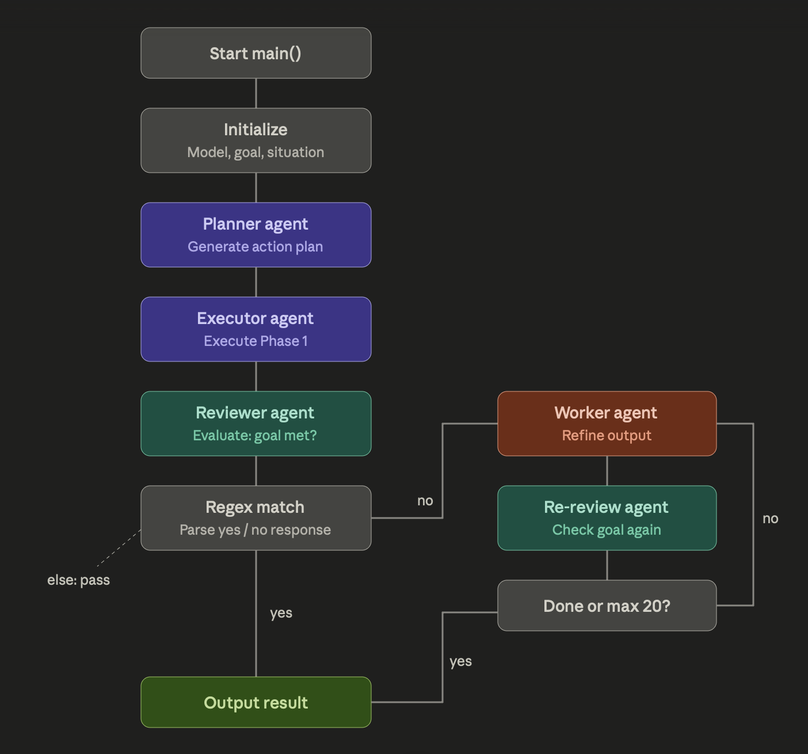

# Plan-Then-Execute Agent

A lightweight autonomous agent that breaks a goal into a plan, executes it phase-by-phase, and self-reviews — all powered by a local [Ollama](https://ollama.com/) instance.
   - main idea is to have it running on a differnt computer on your network

> **Status:** Early prototype. The core loop works, but several pieces (dynamic model selection, user input, the Python tool) are stubbed out. See the roadmap below. The main loop isnt done yet, in the regx if it complets a goal, noting happens. file saving not a thing yet, lots of problems

---
## Current architecture

- image made with claude from current code
- need to finsih up the main loop and add tool calling


## How It Works

The agent follows a three-stage cycle:

1. **Plan** — A planner LLM receives the goal and situation, then produces a phased plan with milestones, a critical path, and risky assumptions.
2. **Execute** — An executor LLM takes Phase 1 of the plan and produces real output (code, drafts, etc.) rather than describing what it *would* do.
3. **Review** — A reviewer LLM checks the output against the original goal and returns a simple YES/NO verdict.
   - **YES →** Done.
   - **NO →** A worker prompt feeds the plan, prior output, and context back into the model and loops until the goal is met.

Each stage uses a separate system prompt so the model stays focused on one job at a time.

## Requirements

- **Python 3.10+**
- **Ollama ≥ 0.9** (for the `think` parameter)
- An Ollama-compatible model pulled locally (default: `qwen3:14b`)
- `requests` library

## Setup

```bash
# 1. Install Ollama and pull a model
ollama pull qwen3:14b

# 2. Install the Python dependency
pip install requests

# 3. Update the Ollama URL in agent.py if your server isn't at the default
#    URL = "http://192.168.1.134:11434"
```
## sever computer

## Usage

```bash
python agent.py
```

On launch the agent will:

1. List available models from your Ollama instance.
2. Run the planning stage and print the plan.
3. Execute Phase 1 and print the deliverable.
4. Self-review and, if the goal isn't met, loop with a worker prompt until it is.

The goal and situation are currently hardcoded near the top of `main()`.

## Configuration

| Variable | Location | Purpose |
|---|---|---|
| `URL` | Module level | Ollama server address |
| `model` | `main()` | Which Ollama model to use |
| `goal` | `main()` | What the agent is trying to accomplish |
| `situation` | `main()` | Context, constraints, and resources |

## Project Structure

```
agent.py          # Everything lives here for now — prompts, HTTP helpers, main loop
```

## Known Limitations

- **Hardcoded goal and model.** Both are set inside `main()` with TODO markers for making them dynamic.
- **Single-phase execution.** Only Phase 1 of the plan is executed; later phases aren't wired up yet.
- **Review loop bug.** The `while` loop re-checks the goal but doesn't update `string_list`, so the exit condition never triggers. The `counter` variable also references `count` (the `itertools` import) instead of `counter`.
- **No tool use.** `python_tool()` is defined but not implemented — the agent can't yet run the code it generates.
- **No conversation memory.** Each LLM call is a single user turn; the model doesn't see prior exchanges.
- **No file output.** Generated artifacts are printed to the console but not written to disk (a `write_text_file` helper exists but isn't called).

## Roadmap

Rough priorities based on the TODOs in the code:

1. **Accept goal and situation from user input** (CLI args or interactive prompt).
2. **Fix the review loop** so it properly exits on YES and accumulates context across iterations.
3. **Dynamic model selection** — pick a model from the available list or let the user choose.
4. **Implement `python_tool()`** — sandbox-execute generated Python and feed the output back to the agent.
5. **Multi-phase execution** — iterate through all phases of the plan, not just Phase 1.
6. **Write output to files** — use `write_text_file()` to persist deliverables.

Other things to deal with
- update read me
   - add the steps on how to connect to your own computer
   - how to step how the networking steps

## License

MIT License