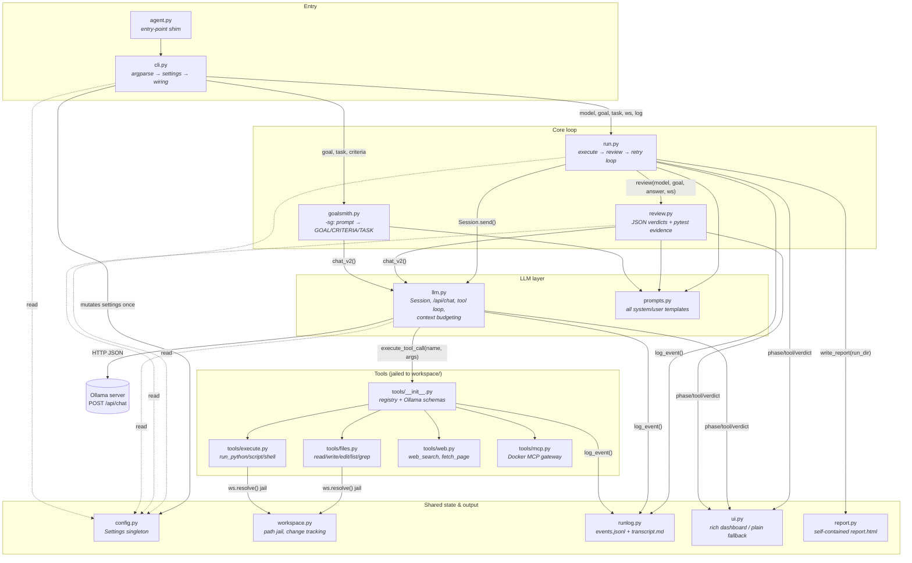
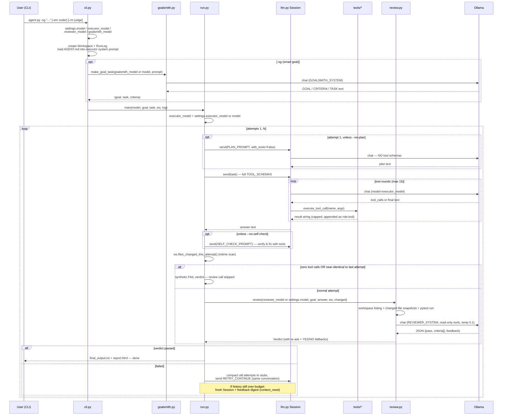
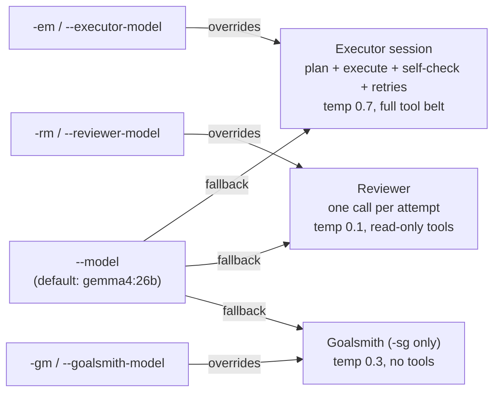
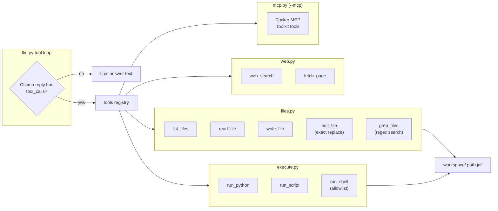

# Execute → Review → Retry Agent

A lightweight autonomous agent harness powered by a local [Ollama](https://ollama.com/) instance
(designed to run against an Ollama server on another computer on your network).

An **executor** LLM does the work with real tools in an isolated per-run workspace, a
**reviewer** LLM checks the actual files on disk against the goal, and failed attempts are
retried with the reviewer's feedback — in the *same* conversation, so the model remembers
what it already tried.

```bash
python3 agent.py -g "Write fizzbuzz.py that prints FizzBuzz for 1-30, run it, and confirm the output"
```

## Architecture

Every box below is one file in `harness/`. Arrows show who calls whom.



## The run loop, end to end

What actually happens on `python3 agent.py -sg "..."`, in order:



## Which model runs where

`--model` is the default for every role; each role can be overridden independently
(the Claude-Code pattern of a cheap default plus specialists):



- The plan and self-check turns live **inside the executor session**, so `-em` covers them too.
- The resolved models are logged in the `run_start` event of `events.jsonl` and shown in the
  dashboard header.
- Models that don't support Ollama's `think` parameter (e.g. `qwen2.5-coder`) are detected on
  the first 400 response and retried without it — no crash, no flag needed.

```bash
python3 agent.py -g "..." -em qwen2.5-coder:7b            # coder executes, default model judges
python3 agent.py -sg "..." -gm gemma4:26b -em codestral   # general model shapes the goal, coder builds
```

## Data exchange between files

Who produces what, and who consumes it:

| Data | Produced by | Consumed by | Shape |
|---|---|---|---|
| `Settings` | `config.py` (defaults) + `cli.py` (one mutation at startup) | every module, read-only | dataclass singleton `settings` |
| `(goal, task, criteria)` | `goalsmith.py` (`-sg`) or verbatim from `-g` | `run.py` (executor msg), `review.py` (checklist) | `tuple[str, str, list[str]]` |
| Executor system prompt | `prompts.EXECUTOR_SYSTEM` + `cli.py` appends AGENT.md and MCP tool notes | `llm.Session` (message 0) | string |
| Conversation history | `llm.Session.messages` — grows with every turn, compacted between attempts | Ollama `/api/chat` payload | `list[{role, content, tool_calls?}]` |
| Tool calls | Ollama reply `tool_calls` | `tools.execute_tool_call` → result appended back as a `role: tool` message | name + JSON args → capped string |
| Changed files | `workspace.files_changed_this_attempt()` (mtime scan — catches files written by *any* tool) | `review.py` snapshots, `run.py` stall gate, logs | `list[str]` relative paths |
| Review evidence | `workspace.snapshot_files()` + `review.automated_checks()` (pytest) | `REVIEW_USER` prompt | capped text blocks |
| `Verdict` | `review.parse_verdict()` (JSON → re-ask → YES/NO → default NO) | `run.py` pass/retry decision, retry feedback | `{passed, criteria[], feedback}` |
| Retry message | `run.py` from `Verdict.unmet()` + feedback history | same executor `Session` (preferred) or a fresh one | `RETRY_CONTINUE` / `RETRY_NOTE` template |
| `events.jsonl` | `runlog.log_event()` called from `run.py`, `llm.py`, `tools/` | `report.py`, `evals/run_evals.py`, you | one JSON object per line |
| `report.html` | `report.py` at the end of every run | your browser | self-contained HTML |

Two deliberately global handles keep the deep call sites simple: `config.settings`
(read everywhere, written only by `cli.py` at startup) and `runlog.current` (so
`llm._post_chat` and `execute_tool_call` can log without threading a logger through
every signature). Tools get the workspace bound via `functools.partial` in
`tools.configure(ws)` — the LLM never sees or passes filesystem paths outside the jail.

## Per-run isolation

Every run gets its own directory — nothing is written to the repo root, and leftovers
from one run can't confuse the next:

```
runs/run_20260703_154139/
├── workspace/           # the ONLY directory the agent can see and touch
│   └── AGENT.md         # optional: auto-loaded into the executor system prompt
├── transcript.md        # human-readable log of every attempt + verdict
├── events.jsonl         # machine log: llm calls (real token counts), tool calls, attempts
├── attempt_1.txt        # prose of each failed attempt
├── attempt_history.json
├── report.html          # self-contained visual report
└── final_output.txt     # or final_output_UNVERIFIED.txt if attempts ran out
runs/latest              # symlink to the most recent run
```

The jail is `workspace.resolve()`: every file tool resolves its path against
`workspace/` and refuses anything that escapes it (`../`, absolute paths). Change
tracking is mtime-based, so the reviewer judges files however they were produced —
`write_file`, `run_python`, a shell command, anything.

Reuse a previous workspace (to continue earlier work) with
`--workspace runs/run_.../workspace`.

## The tool belt



The reviewer gets a **read-only subset** (`read_file`, `list_files`, `run_script`,
`run_shell`) so it can gather evidence but never fix the work itself. `--no-reviewer-tools`
drops even those for a faster snapshot-only review.

## Usage

```bash
python3 agent.py -g "Write fizzbuzz.py that prints FizzBuzz for 1-30, run it, and confirm the output"
python3 agent.py -sg "I need a small flask api for notes"          # goalsmith mode
python3 agent.py -g "..." --model qwen3.5:9b --attempts 3
python3 agent.py -g "..." -rm qwen3.6:27b                          # bigger model as judge (--reviewer-model)
python3 agent.py -g "..." -em qwen2.5-coder:7b                     # coding model for the executor only (--executor-model)
python3 agent.py -sg "..." -gm gemma4:26b -em codestral            # separate goalsmith model (--goalsmith-model)
python3 agent.py -g "..." --num-ctx 32768 --full-context           # no trimming at all
python3 agent.py -g "..." --mcp                                    # + Docker MCP Toolkit tools
python3 agent.py -g "..." --workspace runs/latest/workspace        # continue earlier work
python3 agent.py -g "..." --no-reviewer-tools                      # faster, snapshot-only review
python3 agent.py -g "..." --best-of 3                              # 3 independent first attempts, keep the best
python3 agent.py -g "..." --no-plan --no-self-check                # skip the quality turns (faster)
```

Every attempt runs three phases by default: a **planning turn** (attempt 1 only — the
model commits to filenames and a verification step before touching tools), the
**execution** itself, and a **self-check turn** (re-verify each criterion with tools and
fix failures before the reviewer sees it). `--best-of N` additionally runs N independent
first attempts in separate `candidate_*` workspaces, reviews each, and continues the loop
from the winner. On a real terminal you get a live rich dashboard (attempt/phase/token
budget/tool log); piped output falls back to plain lines. Every run ends by writing a
self-contained **`report.html`** into the run dir (regenerate with
`python3 -m harness.report runs/latest`).

## Context management

Local models have small windows, so the harness spends tokens deliberately:

- **Compaction between attempts** — finished failed attempts are collapsed to one-line
  stubs; the model keeps *that* it tried something and *why* it failed, not every byte.
- **Same-session retries** — the preferred retry path continues the existing conversation.
  Only when the history exceeds the budget even after compaction does the harness start a
  fresh session with a digest of all reviewer feedback (logged as `context_reset`).
- **Caps everywhere** — tool results, reviewer snapshots, retry context, and page text are
  all bounded by knobs in `config.py` (`tool_result_max`, `retry_prev_max`, ...).
- **Real token counts** — Ollama's `prompt_eval_count` is logged per call, and the harness
  warns when a prompt passes 85% of `--num-ctx`.
- `--full-context` disables all of it for models with room to spare.

## Project structure

```
agent.py              # entry-point shim (python3 agent.py -g ...)
harness/
├── cli.py            # argument parsing, settings mutation, AGENT.md/MCP wiring
├── config.py         # Settings dataclass: models per role, budgets, temperatures
├── prompts.py        # executor / reviewer / goalsmith / retry prompt templates
├── llm.py            # Ollama chat, Session (persistent retry memory), context budgeting
├── workspace.py      # per-run dirs, path jail, mtime-based change tracking
├── runlog.py         # transcript.md + events.jsonl writers
├── review.py         # JSON verdicts with fallback parsing, automated pytest checks
├── goalsmith.py      # -sg: request → goal + criteria + task
├── run.py            # the execute → review → retry loop (+ plan/self-check/best-of)
├── ui.py             # rich live dashboard, plain-print fallback
├── report.py         # self-contained report.html per run
└── tools/
    ├── __init__.py   # registry, Ollama schemas, execute_tool_call dispatch
    ├── files.py      # read/write/edit/list/grep, all jailed
    ├── execute.py    # run_python / run_script / run_shell (allowlisted)
    ├── web.py        # web_search (ddgs), fetch_page (trafilatura)
    └── mcp.py        # Docker MCP Toolkit gateway client
tests/                # pytest suite for the harness itself (venv/bin/python -m pytest)
evals/                # benchmark goals + runner for measuring harness changes
```

## Requirements

- **Python 3.10+**
- **Ollama ≥ 0.9** (for the `think` parameter; non-thinking models are handled automatically)
- `pip install requests` (plus optional `ddgs` and `trafilatura` for the web tools,
  and `pytest` to run the harness's own tests)

## Measuring changes (eval suite)

`evals/` holds 8 benchmark goals (4 multi-file projects, 4 data/file-processing tasks),
each with seeded input files and a programmatic checker that judges the workspace
independently of the harness's own reviewer:

```bash
venv/bin/python evals/run_evals.py --label after            # run all 8, write results_after.json
venv/bin/python evals/run_evals.py --goals csv_cleanup      # subset
venv/bin/python evals/run_evals.py --label after --compare evals/results_baseline.json
```

Keep `--attempts` constant across runs you compare. To capture a **baseline for the
pre-improvement harness** (the eval suite works against whatever code is checked out):

```bash
git stash                                                    # park the new harness code
venv/bin/python evals/run_evals.py --label baseline
git stash pop
venv/bin/python evals/run_evals.py --label after --compare evals/results_baseline.json
```

### Picking a bigger reviewer model

The reviewer runs once per attempt, so a larger/stricter model is usually worth it.
When the Ollama box is up: `ollama list` (or `curl http://<ip>:11434/api/tags`) to see
what fits, pull 2–3 candidates in the ~30B-class, then A/B them:

```bash
venv/bin/python evals/run_evals.py --label rev_candidate --reviewer-model <candidate> \
    --compare evals/results_baseline.json
```

and set the winner as `reviewer_model` in `harness/config.py` (currently `None` = same
as the executor; `-rm` overrides per run). The runner also accepts
`--agent-args='--best-of 2'` etc. for A/B-ing other flags — including `-em` to
benchmark coder models as executors.

## Ollama server setup (separate computer)

1. Allow LAN access to Ollama on the server (Windows PowerShell, admin):
```powershell
New-NetFirewallRule -DisplayName "Ollama LAN Access" -Direction Inbound -LocalPort 11434 -Protocol TCP -Action Allow -Profile Private
# this allows any computer on your network to access ollama
```
2. Find the server's IP with `ipconfig`.
3. Test it in a browser: `http://<server-ip>:11434` should answer "Ollama is running".
4. Point the agent at it: `--url http://<server-ip>:11434` (or change the default in
   `harness/config.py`).

## Configuration

Defaults live in `harness/config.py` (`Settings` dataclass): server URL, per-role models
(`model`, `executor_model`, `reviewer_model`, `goalsmith_model`), context window,
truncation caps, and per-role sampling options (executor 0.7, reviewer 0.1,
goalsmith 0.3). Everything relevant is also overridable per run via CLI flags
(`--url`, `--model`, `-em`, `-rm`, `-gm`, `--num-ctx`, `--attempts`, ...).

## Roadmap

- Multi-phase planning for big goals (plan → execute each phase → review each phase)
- Streaming output so long generations show progress
- Subagents: scoped executor sessions whose summaries return to the parent context
- Persist run history to sqlite for cross-run "what did I do last time" queries
- Sandboxed execution (containers) instead of the command allowlist

## License

MIT License
